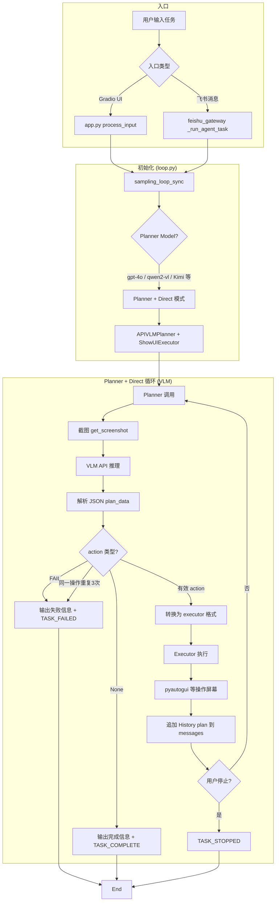
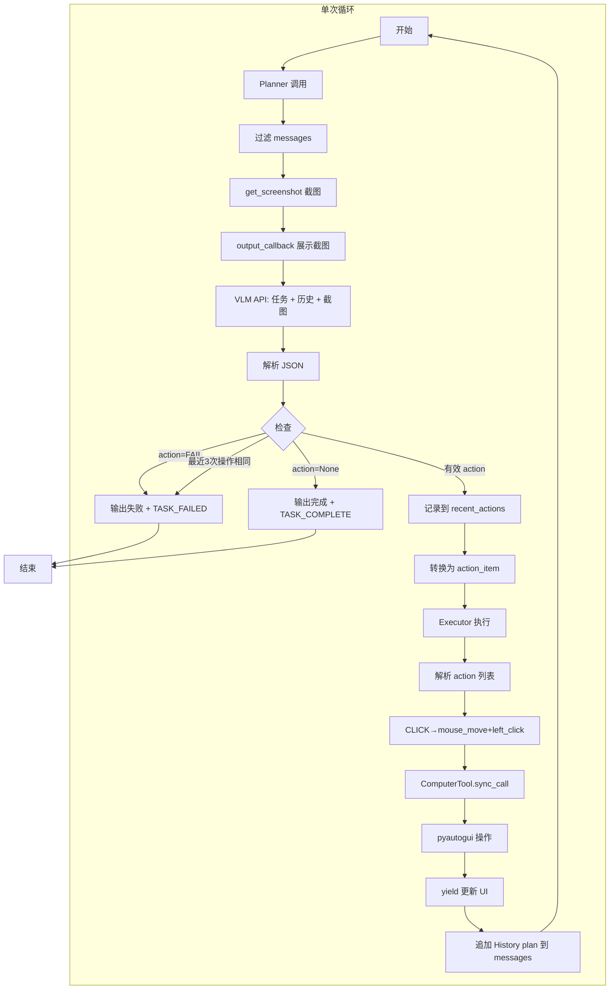
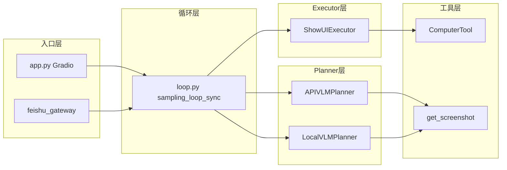
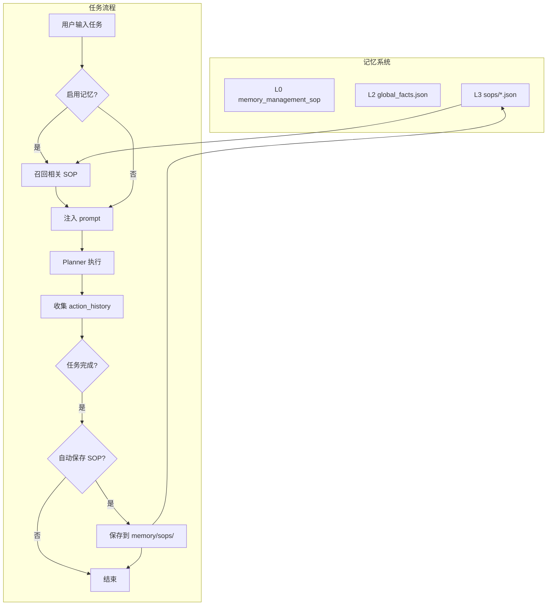

# DeskClaw 工作流程图

## 整体流程

## Planner + Actor 模式详细流程

## 组件关系图

## 终止条件汇总

| 条件 | 信号 | 触发位置 |
|------|------|----------|
| 任务完成 | TASK_COMPLETE | action=None 或 executor 无 tool_result |
| 任务失败 | TASK_FAILED | action=FAIL 或 同一操作重复3次 |
| 用户停止 | TASK_STOPPED | stop_requested() 返回 True |

## 记忆系统与 SOP（参考 pc-agent-loop）

- **召回**：根据任务关键词匹配已有 SOP，注入到 system prompt 作为参考
- **保存**：任务成功完成后，将步骤序列保存为 SOP，下次类似任务可召回
